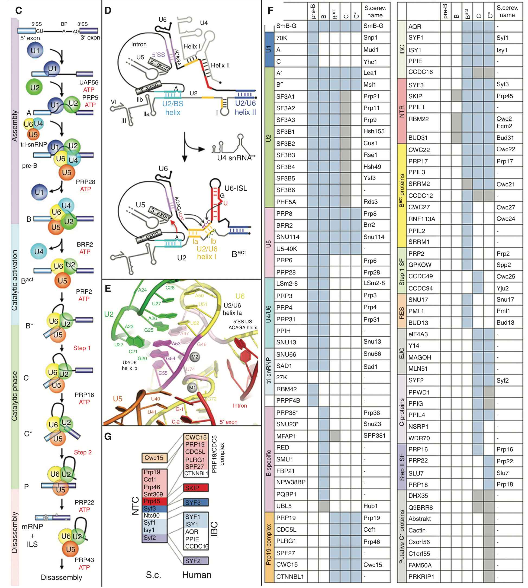
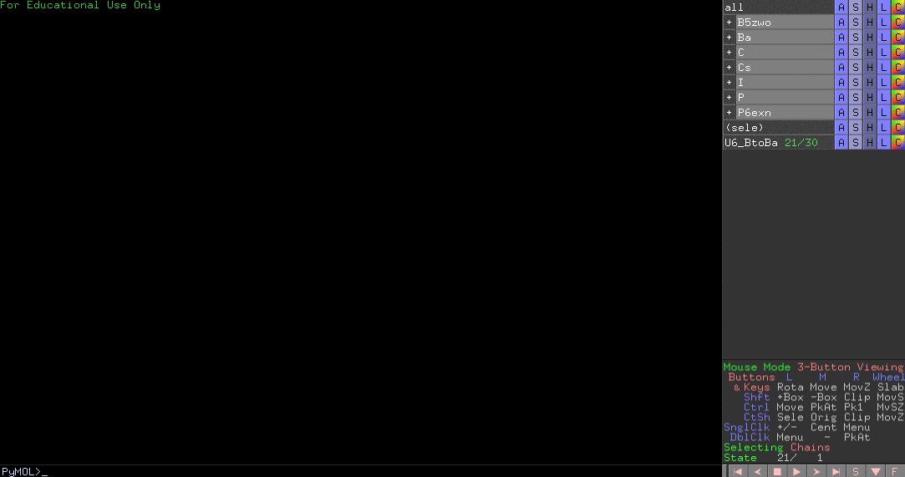
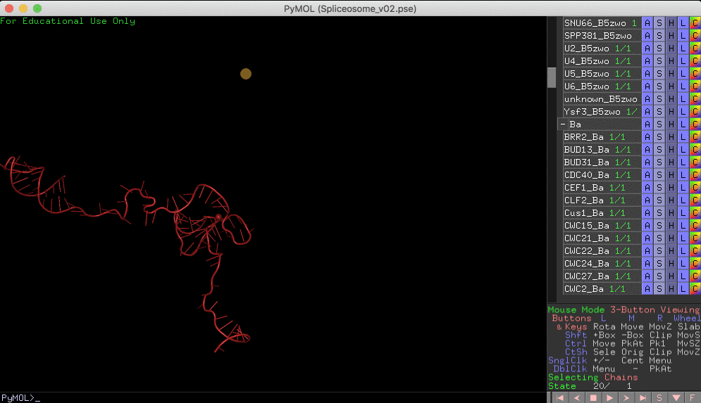
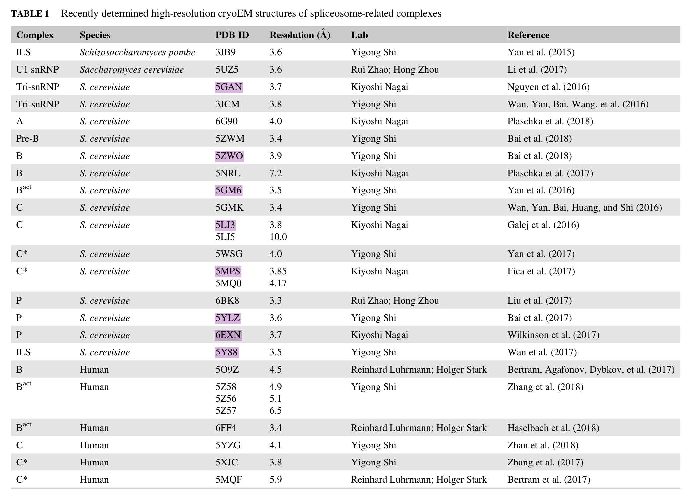
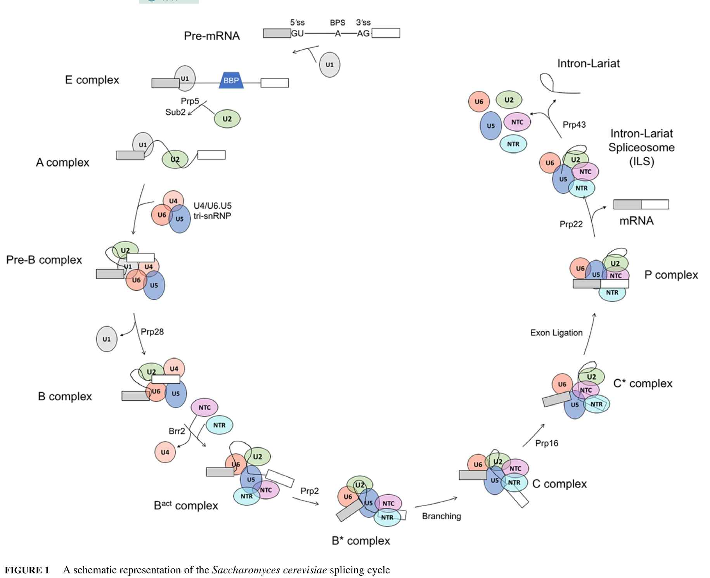

# PyMOL4Spliceosome: all spliceosome structures in one PyMOL session

  

This project is a part of my [rna-tools](https://github.com/mmagnus/rna-tools/blob/master/rna_tools/tools/PyMOL4RNA/), so please cite this paper if you find this repository useful for you:

	Magnus M, Antczak M, Zok T, Wiedemann J, Lukasiak P, Cao Y, Bujnicki JM, Westhof E, Szachniuk M, Miao Z. 
	RNA-Puzzles toolkit: a computational resource of RNA 3D structure benchmark datasets, structure manipulation, 
	and evaluation tools. 
	Nucleic Acids Research. 2019 10.1093/nar/gkz1108 
<https://academic.oup.com/nar/advance-article/doi/10.1093/nar/gkz1108/5651330>

Table of Contents
=================

* [Index](#index)
  * [Yeast](#yeast)
  * [Human](#human)
* [Find your favorite protein\!](#find-your-favorite-protein)
* [Examples of usage](#examples-of-usage)
  * [Select all U6](#select-all-u6)
  * [Morph between two main conformations of U6](#morph-between-two-main-conformations-of-u6)
* [Tips](#tips)
* [Quick reference](#quick-reference)
* [External](#external)
* [Notes](#notes)
* [Changelog](#changelog)
* [Acknowledgement](#acknowledgement)
* [Supplements](#supplements)

Created by [gh-md-toc](https://github.com/ekalinin/github-markdown-toc.go)

Processed PyMOL session of cryo-em structures, see <https://github.com/mmagnus/PyMOL4Spliceosome/releases> to learn more about current stage of the project.

<big><b>The session now is very big and it might slow your computer. We recommend to open it one, remove unnecessary things for your analysis and save it as a new session.</b></big>

(BTW, the intron here is in black, it's fixed in the version 0.31, now the intron is in gray)

The structures superimposed based on the U6 RNA (if possible) or Prp8.

Colors and chain mapping based on [Spliceosome_PyMOL](https://github.com/mmagnus/rna-tools/blob/master/rna_tools/tools/PyMOL4RNA/Spliceosome_PyMOL.csv) prepared by Eysmont and Magnus, merged with https://github.com/maxewilkinson/Spliceosome-PyMOL-sessions.

Not everything is perfect, expect some updates soon.

See <https://github.com/mmagnus/PyMOL4Spliceosome/releases>

and read more about the tool used to obtain this session: <https://github.com/mmagnus/rna-tools/blob/master/rna_tools/tools/PyMOL4RNA/>

# Index

All processed structures can be viewed and searched in this repository:

<https://github.com/mmagnus/rna-tools/blob/master/rna_tools/tools/PyMOL4RNA/Spliceosome_PyMOL.csv>

## Yeast

| x     | Complex   | PDB ID                                      | Resolution (Å) | Lab           | Reference               |
|-------|-----------|---------------------------------------------|----------------|---------------|-------------------------|
| x     | E         | [6N7P](https://www.rcsb.org/structure/6N7P) | 3.6            | Rui Zhao      | Li et al. (2019)        |
| x     | E         | [6N7R](https://www.rcsb.org/structure/6N7R) | 3.20           | Rui Zhao      | Li et al. (2019)        |
| x     | Tri-snRNP | [5GAN](https://www.rcsb.org/structure/5GAN) | 3.7            | Kiyoshi Nagai | Nguyen et al. (2016)    |
| #todo | Pre-B     | [5ZWM](https://www.rcsb.org/structure/5ZWM) | 3.4            | Yigong Shi    | Bai et al. (2018)       |
| x     | B         | [5ZWO](https://www.rcsb.org/structure/5ZWO) | 3.9            | Yigong Shi    | Bai et al. (2018)       |
| x     | Bact      | [5GM6](https://www.rcsb.org/structure/5GM6) | 3.5            | Yigong Shi    | Yan et al. (2016)       |
| x     | C         | [5LJ3](https://www.rcsb.org/structure/5LJ3) | 3.8            | Kiyoshi Nagai | Galej et al. (2016)     |
| x     | C         | [5GMK](https://www.rcsb.org/structure/5GMK) | 3.85           | Yigong Shi    | Wan et al. (2016)       |
| x     | C*        | [5MPS](https://www.rcsb.org/structure/5MPS) | 3.85           | Kiyoshi Nagai | Fica et al. (2017)      |
| x     | P         | [5YLZ](https://www.rcsb.org/structure/5YLZ) | 3.6            | Yigong Shi    | Bai et al. (2017)       |
| x     | P         | [6EXN](https://www.rcsb.org/structure/6EXN) | 3.7            | Kiyoshi Nagai | Wilkinson et al. (2017) |
| x     | ILS       | [5Y88](https://www.rcsb.org/structure/5Y88) | 3.5            | Yigong Shi    | Wan et al. (2017)       |
| -     | ILS       | [3JB9](https://www.rcsb.org/structure/3JB9) | 3.60           | Yigong Shi    | Yan et al. (2015)       |

Adapted and updated: L. Zhang, A. Vielle, S. Espinosa, and R. Zhao, “RNAs in the spliceosome: Insight from cryoEM structures,” WIREs RNA, vol. 10, no. 3, pp. e1523–11, Apr. 2019.

<small>
	
*A unified mechanism for intron and exon definition and back-splicing.*  
Li, X., Liu, S., Zhang, L., Issaian, A., Hill, R.C., Espinosa, S., Shi, S., Cui, Y., Kappel, K., Das, R., Hansen, K.C., Zhou, Z.H., Zhao, R.
(2019) Nature 573: 375-380  
6N7P: S. cerevisiae spliceosomal E complex (UBC4)  
6N7R: S. cerevisiae spliceosomal E complex (ACT1)  

*Cryo-EM structure of the yeast U4/U6.U5 tri-snRNP at 3.7 angstrom resolution.*  
Nguyen, T.H., Galej, W.P., Bai, X.C., Oubridge, C., Newman, A.J., Scheres, S.H., Nagai, K.  
(2016) Nature 530: 298-302  
5GAN: The overall structure of the yeast spliceosomal U4/U6.U5 tri-snRNP at 3.7 Angstrom  

*Structures of the fully assembled Saccharomyces cerevisiae spliceosome before activation*  
Bai, R., Wan, R., Yan, C., Lei, J., Shi, Y.  
(2018) Science 360: 1423-1429  
5ZWM: Cryo-EM structure of the yeast pre-B complex at an average resolution of 3.4~4.6 angstrom (tri-snRNP and U2 snRNP Part)  
5ZWO: Cryo-EM structure of the yeast B complex at average resolution of 3.9 angstrom  

*Structure of a yeast activated spliceosome at 3.5 angstrom resolution*  
Yan, C., Wan, R., Bai, R., Huang, G., Shi, Y.  
(2016) Science 353: 904-911  
5GM6 Cryo-EM structure of the activated spliceosome (Bact complex) at 3.5 angstrom resolution  

*Cryo-EM structure of the spliceosome immediately after branching.*  
Galej, W.P., Wilkinson, M.E., Fica, S.M., Oubridge, C., Newman, A.J., Nagai, K.  
(2016) Nature 537: 197-201  
5LJ3:Structure of the core of the yeast spliceosome immediately after branching  

Structure of a yeast catalytic step I spliceosome at 3.4 angstrom resolution
Wan, R., Yan, C., Bai, R., Huang, G., Shi, Y.
(2016) Science 353: 895-904
5GMK: Cryo-EM structure of the Catalytic Step I spliceosome (C complex) at 3.4 angstrom resolution

*Structure of a spliceosome remodelled for exon ligation.*  
Fica, S.M., Oubridge, C., Galej, W.P., Wilkinson, M.E., Bai, X.C., Newman, A.J., Nagai, K.  
(2017) Nature 542: 377-380  
5MPS: Structure of a spliceosome remodeled for exon ligation  

*Structure of the Post-catalytic Spliceosome from Saccharomyces cerevisiae*  
Bai, R., Yan, C., Wan, R., Lei, J., Shi, Y.  
(2017) Cell 171: 1589-1598.e8  
5YLZ: Cr yo-EM Structure of the Post-catalytic Spliceosome from Saccharomyces cerevisiae at 3.6 angstrom  

*Postcatalytic spliceosome structure reveals mechanism of 3'-splice site selection.*  
Wilkinson, M.E., Fica, S.M., Galej, W.P., Norman, C.M., Newman, A.J., Nagai, K.  
(2017) Science 358: 1283-1288  
6EXN: Post-catalytic P complex spliceosome with 3' splice site docked  

*Structure of an Intron Lariat Spliceosome from Saccharomyces cerevisiae*  
Wan, R., Yan, C., Bai, R., Lei, J., Shi, Y.  
(2017) Cell 171: 120-132  
5Y88: Cryo-EM structure of the intron-lariat spliceosome ready for disassembly from S.cerevisiae at 3.5 angstrom  

Structure of a yeast spliceosome at 3.6-angstrom resolution
Yan, C., Hang, J., Wan, R., Huang, M., Wong, C., Shi, Y.
(2015) Science 349: 1182-1191
3JB9: Cryo-EM structure of the yeast spliceosome at 3.6 angstrom resolution
</small>

## Human

| x | Complex   | PDB ID                                      | Resolution (Å) | Lab           | Reference               |
|---|-----------|---------------------------------------------|----------------|---------------|-------------------------|
| x | Tri-snRNP | [6QW6](https://www.rcsb.org/structure/6QW6) | 2.92           | Kiyoshi Nagai | Charenton et al. (2019) |
| x | Pre-B     | [6QX9](https://www.rcsb.org/structure/6QX9) | 3.28           | Kiyoshi Nagai | Charenton et al. (2019) |
| x | B         | [6AHD](https://www.rcsb.org/structure/6AHD) | 3.80           | Yigong Shi    | Zhan et al. (2018)      |

[5XJC](https://www.rcsb.org/structure/5XJC)

5XJC Cryo-EM structure of the human spliceosome just prior to exon ligation at 3.6 angstrom

An Atomic Structure of the Human Spliceosome
Zhang, X., Yan, C., Hang, J., Finci, L.I., Lei, J., Shi, Y.
(2017) Cell 169: 918-929.e14
5XJC Cryo-EM structure of the human spliceosome just prior to exon ligation at 3.6 angstrom

*Mechanism of 5' splice site transfer for human spliceosome activation.  *
Charenton, C., Wilkinson, M.E., Nagai, K.  
(2019) Science 364: 362-367  
6QW6: Structure of the human U5.U4/U6 tri-snRNP at 2.9A resolution.  
6QX9: Structure of a human fully-assembled precatalytic spliceosome (pre-B complex).  

*Structures of the human pre-catalytic spliceosome and its precursor spliceosome.  *
Zhan, X., Yan, C., Zhang, X., Lei, J., Shi, Y.  
(2018) Cell Res 28: 1129-1140  
6AHD: The Cryo-EM Structure of Human Pre-catalytic Spliceosome (B complex) at 3.8 angstrom resolution  

## Pombe

| x | Complex | PDB ID                                      | Resolution (Å) | Lab        | Reference          |
|---|---------|---------------------------------------------|----------------|------------|--------------------|
| x | ILS     | [3JB9](https://www.rcsb.org/structure/3JB9) | 3.60           | Yigong Shi | Yuan et al. (2015) |

*Structure of a yeast spliceosome at 3.6-angstrom resolution*__
Yan, C., Hang, J., Wan, R., Huang, M., Wong, C., Shi, Y.
(2015) Science 349: 1182-1191

# Find your favorite protein!

<small>Assembly, catalytic activation, and disassembly pathway of the spliceosome. For simplicity, the ordered interactions of the U1, U2, U4/
U6, and U5 small nuclear ribonucleoproteins (snRNPs), but not non-snRNP spliceosomal proteins, are shown.
Helicases required for splicing in both yeast and humans are indicated and include the Ski2-like helicase BBR2, the
DEAD-box helicases UAP56, PRP5, and PRP28, and the DEAH-box helicases PRP2, PRP16, PRP22, and PRP43. (D)
Dynamic network of RNA–RNA interactions in the spliceosomal B and Bact complexes. (E) 3D structure of the
catalytic RNA network (in the human C∗ complex), showing the coordination of the catalytic magnesium ions M1
and M2. (F) Dynamic exchange of spliceosomal proteins during splicing. Proteins present in pre-B, B, Bact, C, or C∗
human spliceosomal complexes are indicated by a square, in which blue denotes highly abundant and gray moder-
ately abundant proteins. Serine-arginine (SR) dipeptide-rich proteins and heterogeneous nuclear ribonucleoproteins
(hnRNPs), as well as those present in very low amounts, are not shown. The table summarizes the proteomes of
various, recently purified human spliceosomal complexes (Agafonov et al. 2011; De et al. 2015; Boesler et al. 2016; Bertram et al. 2017b), as well as our unpublished work.
*Prp38 and Snu23 are associated with the tri-snRNP in S. cerevisiae. (G) Differential pre-organization of yeast nineteen complex (NTC) proteins in humans.  
</small>

Source: B. Kastner, C. L. Will, H. Stark, and R. Luhrmann, “Structural Insights into Nuclear pre-mRNA Splicing in Higher Eukaryotes.,” Cold Spring Harbor Perspectives in Biology, pp. a032417–20, Feb. 2019.

# Examples of usage
## Select all U6

## Morph between two main conformations of U6

# Tips

    With Up Down with Righ-mouse Click

# Quick reference

	PyMOL>enable CWC15*
	PyMOL>disable CWC15*

    # select only some objects and save it to the file
    save /Users/magnus/Desktop/XXXX_triplex_zoom.pse, CXXX_P and U2_P and U6_P

    select U4* and resi 68-81
    
Read more: <https://pymolwiki.org/index.php/Enable>

# External

You can also download sessions for single steps prepared by the Nagai lab: <https://www2.mrc-lmb.cam.ac.uk/groups/nagai/resources/> and here <https://github.com/maxewilkinson/Spliceosome-PyMOL-sessions>

# Notes
200820 Format for objects: <protein(uppercase)>_<organism: [y h]><stage [yC yCs]>_<pdb_id(uppercase)>, .e.g, CWC15_yC_5GMK

	save aligned/hB_6AHD.pdb, PRP_hB_6AHD
	
	align h3_6QW6 and chain 5A, PRP8_hB_6AHD
	save 
	
	fetch 6QX9
	align 6QX9 and chain 5A, PRP8_hB_6AHD	
	save hBpre_6QX9.cif, 6QX9

	fetch 6QW6
	align 6QW6 and chain 5A, PRP8_hB_6AHD	
	save h3_6QW6.cif, 6QW6

	PyMOL> align yC_5GMK and chain A, PRP8*
	PyMOL>save yC_5GMK.cif, yC_5GMK
	 Save: wrote "yC_5GMK.cif".

	align hC_5YZG and chain F, U6_yC_5GMK
	save hC_5YZG.cif, hC_5YZG
	
	align 5XJC and chain F, U6_*
	save hCs_5XJC.cif, 5XJC

Rings as one object

	extract Lsm_ring_h3_6QW6, (chain 62 and h3_6QW6) or (chain 64 and h3_6QW6)
	
	extract Lsm_ring_h3_6QW6, (chain 62 or chain 64) and h3_6QW6

Sandbox

	PyMOL>select chain 5A and name hBpre_6QX9
    Selector: selection "sele" defined with 0 atoms.

# Changelog

PyMOL>extract SM_ring, SM*
 Save: Please wait -- writing session file...
 Save: wrote "/Users/magnus/work/src/rna-tools/rna_tools/tools/PyMOL4RNA/PyMOL4Spliceosome/release/yCs_5MPS.pse".
- remove exons

v1.1

yB_5ZWO.pse
- merge all LSM into LSM2-8
- upper case for YSF3_B5zwo

pI_3JB9 [new]
- prp5 is prp46 (I think it is), so K goes next to prp46
- Exon_Ba/N/ 100-114 gray50 it's intron, not exon, yBa_5GM6.pse

# Acknowledgement

ReMedy-International Research Agenda Unit, Centre of New Technologies, University of Warsaw, 02-097 Warsaw, Poland

M.M. was supported by the "Regenerative Mechanisms for Health-ReMedy" grant MAB/20172, carried out within the International Research Agendas Program of the Foundation for Polish Science co-financed by the European Union under the European Regional Development Fund.

# Supplements

Full list: http://spliceosomedb.ucsc.edu/structures

Source: L. Zhang, A. Vielle, S. Espinosa, and R. Zhao, “RNAs in the spliceosome: Insight from cryoEM structures,” WIREs RNA, vol. 10, no. 3, pp. e1523–11, Apr. 2019.

Source: L. Zhang, A. Vielle, S. Espinosa, and R. Zhao, “RNAs in the spliceosome: Insight from cryoEM structures,” WIREs RNA, vol. 10, no. 3, pp. e1523–11, Apr. 2019.
