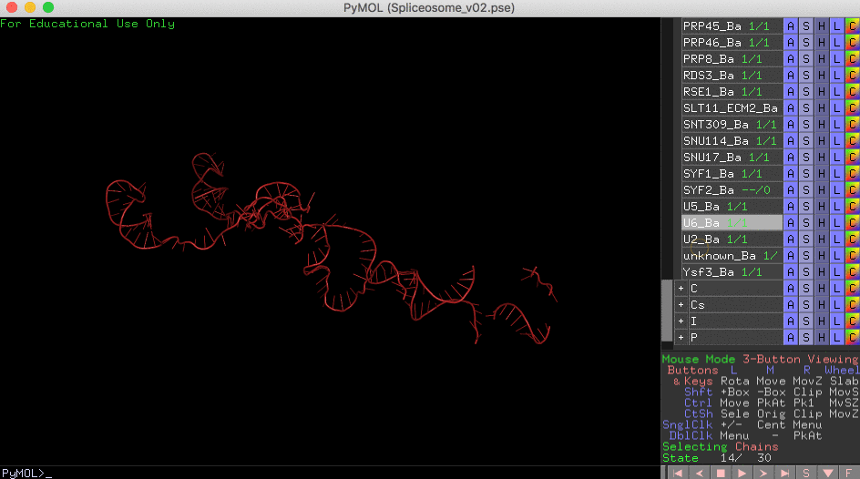

# PyMOL4Spliceosome: all spliceosome structures in one PyMOL session

To download PyMOL session click on the Release button:

PyMOL session of 6 cryo-em structures:

- B complex 5zwo
- B act complex 5gm6
- C complex 5lj3
- C star 5mps
- P complex (two structures)
    - 6exn
    - 5ylz
- ILS 5y88

The structures superimposed based on the U6 RNA.

Colors and chain mapping based on pyMoL_colors-EMX.xlsx prepared by Eysmont and Magnus.

Not everything is perfect, expect some updates soon.

See https://github.com/mmagnus/PyMOL4Spliceosome/releases

and read more about the tool used to obtain this session: https://github.com/mmagnus/rna-tools/blob/master/rna_tools/tools/PyMOL4RNA/README.md

See releases for PyMOL sessions: https://github.com/mmagnus/rna-tools/releases

## Select all U6

## Morph between two main conformations of U6

## Tips

    With Up Down with Righ-mouse Click

## Quick reference

	PyMOL>enable CWC15*
	PyMOL>disable CWC15*

    # select only some objects and save it to the file
    save /Users/magnus/Desktop/XXXX_triplex_zoom.pse, CXXX_P and U2_P and U6_P

Read more: https://pymolwiki.org/index.php/Enable

## External

You can also download sessions for single steps prepared by the Nagai lab: <https://www2.mrc-lmb.cam.ac.uk/groups/nagai/resources/>
